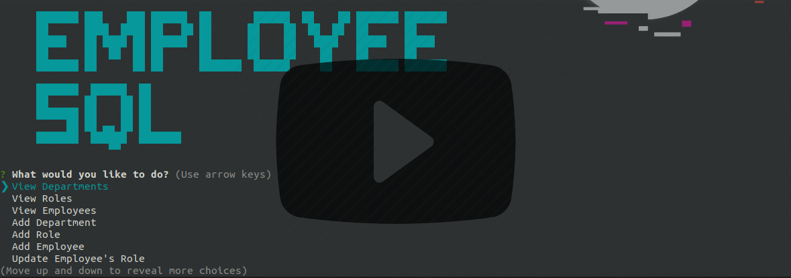
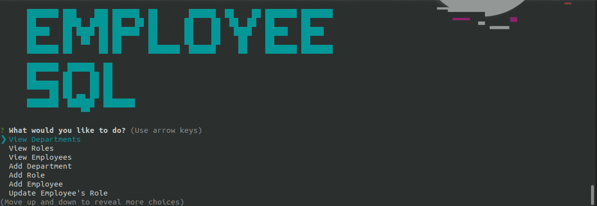
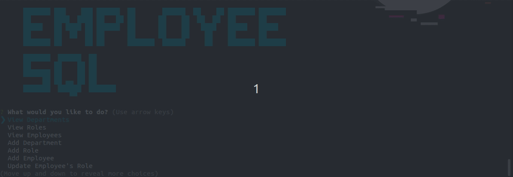
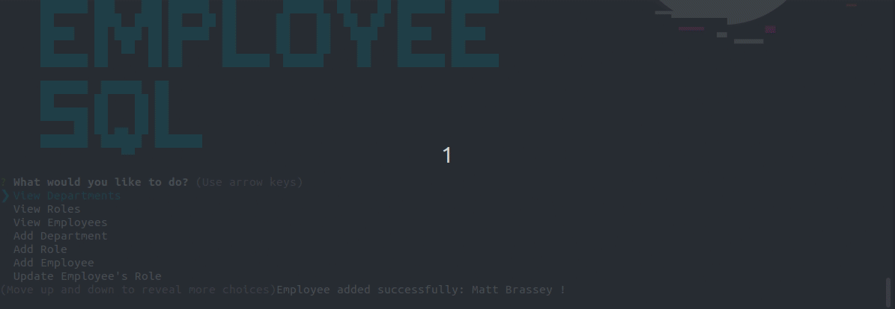

## EmployeeSQL

Manage Departments, Employees & Roles with this node backend application and MySQL database.

#### Issues

- [x] [Setup Project and Database](https://github.com/MBrassey/EmployeeSQL/issues/1)
- [x] [Inquirer & Main Functions](https://github.com/MBrassey/EmployeeSQL/issues/2)
- [x] [Cleanup & Additional Function](https://github.com/MBrassey/EmployeeSQL/issues/3)
- [x] [Generate Gifs & Update Readme](https://github.com/MBrassey/EmployeeSQL/issues/4)

#### Requirements

    node
    npm

#### Installation

    npm i
    npm run migrate

#### Usage

    Usage: node server.js [ -h | -v | -l | -a ]

    [options]

           -h          Display this message.
           -v          Show version.
           -l          Show license info.
           -a          What is EmployeeSQL?

<h6>
:cyclone: Click the image(s) below to view the live <a id="Screenshots" href="https://github.com/MBrassey/EmployeeSQL">webapplication</a>
</h6>

> Video Demonstration
> 

> Setup & Options
> 

> View Departments, Roles & Employees
> 

> Add Department, Role & Employee
> 

> Update Role, Delete Role & Employee
> 

#### Questions

Contact me at [matt@brassey.io](mailto:matt@brassey.io) with any questions or comments.

#### License

`EmployeeSQL` is published under the **CC0_1.0_Universal** license.

> The Creative Commons CC0 Public Domain Dedication waives copyright interest in a work you've created and dedicates it to the world-wide public domain. Use CC0 to opt out of copyright entirely and ensure your work has the widest reach. As with the Unlicense and typical software licenses, CC0 disclaims warranties. CC0 is very similar to the Unlicense.
